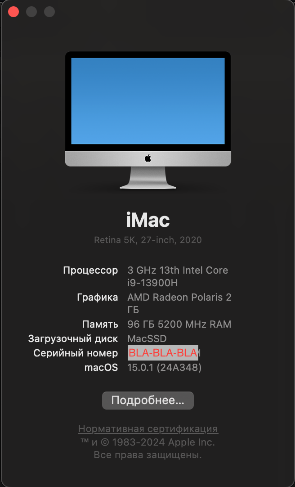
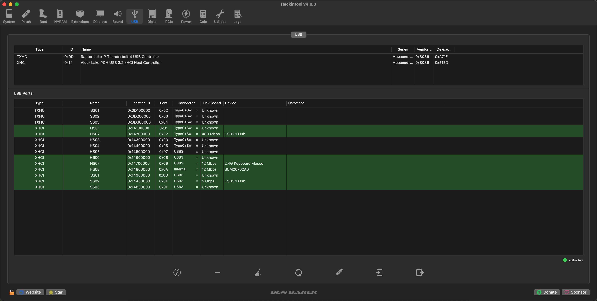

# Fully working Hackintosh build for Minisforum MS-01
## OS: **Sequoia 15.0.1 (24A348)**

## Hardware

- Processor **Intel Core i9-13900H**
- Video card **PowerColor Red Dragon RX-500 2GB GDDR5 LP SL (Lexa core)**
- RAM **96 GB**
- WiFi/BT. Replaced with **BCM94352**

To set up WiFi, you will need to run OCLP->Post-install Root Patch -> Start Root Patching -> reboot -> Clear NVRAM via OpenCore bootloader menu **2 times!!!** After that, both WiFi and BT will work. If at least something does not work, repeat the operation again.

Intel Iris Xe graphics are not supported (or not fully supported) in Hackintosh, so I disabled them and used RX-550, which has a problematic Lexa core, but I managed to overcome this. Now the graphics are 100% working.

Both i-226 Ethernet controllers are enabled, but in the port closer to the middle of the case (I226-V), I caught freezes twice in a week. In the port closer to the SFP ports (I226-LM), this has never happened. I did not enable SFP ports, and I do not need them. In network connections, they are visible as PCI Serial adapter with the status "Not configured".

USB ports are distributed as efficiently as possible, but on some USB 3.2 ports I had to disable USB 2.0 support to make the limits suffice. Below is a map of USB ports.

