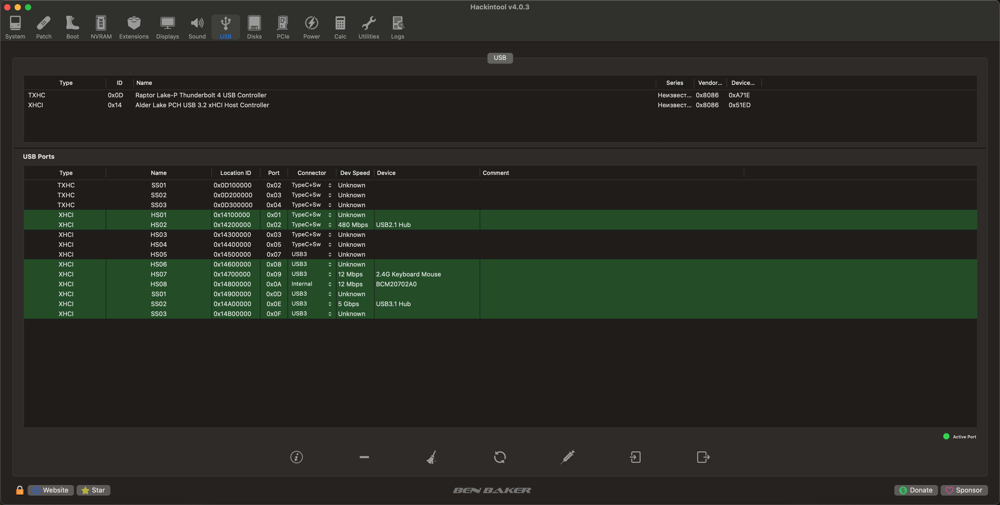

# Полностью рабочая сборка Hackintosh для Minisforum MS-01
For english users use [Readme-en.md](README-en.md)
## Sequoia 15.0.1 (24A348)

## Железо

 - Процессор **Intel Core i9-13900H**
 - Видеокарта **PowerColor Red Dragon RX-500 2GB GDDR5 LP SL (Lexa core)**
 - Оперативная память **98 GB**
 - WiFi/BT. Заменён на **BCM94352**

Для завода WiFi необходимо будет запустить OCLP->Post-install Root Patch -> Start Root Patching -> перезагрузка -> Очистка NVRAM через меню загрузчика OpenCore **2 раза!!!** После чего будет работать и WiFi и BT. Если хоть что-то не работает, повторяем операцию еще раз.

Графика Intel Iris Xe не поддерживается (ну или не полностью) в Hackintosh, поэтому ее  я отключил и использовал RX-550, где есть проблемное ядро Lexa, но я справился и с этим. Теперь графика на 100% рабочая.

Порты USB распределены максимально эффективно, но на некоторых USB 3.2 портах пришлось отключить поддержку USB 2.0, чтобы хватило лимитов. Ниже представлена карта USB портов.

Ethernet контроллеры i-226 заводятся оба, но в порту, который ближе к середине корпуса (I226-V), два раза за неделю ловил зависания. В порту, который ближе к SFP портам (I226-LM) такого не наблюдалось ни разу. SFP порты не заводил, да и не нужны они мне. В сетевых подключениях видны как PCI Serial adapter со статусом "Не настроено".

